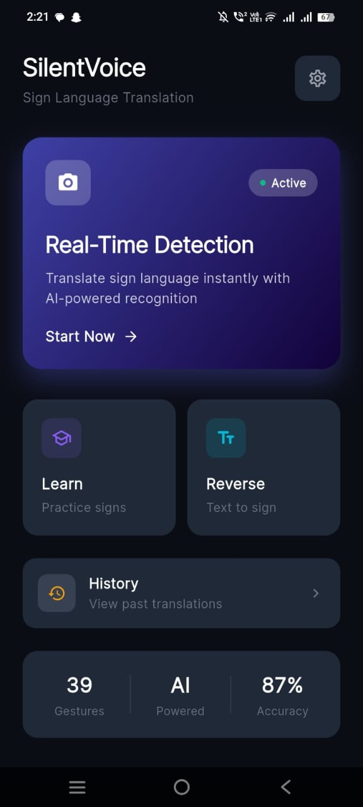
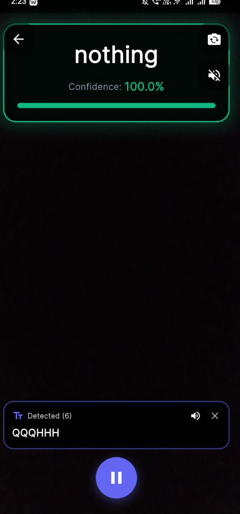
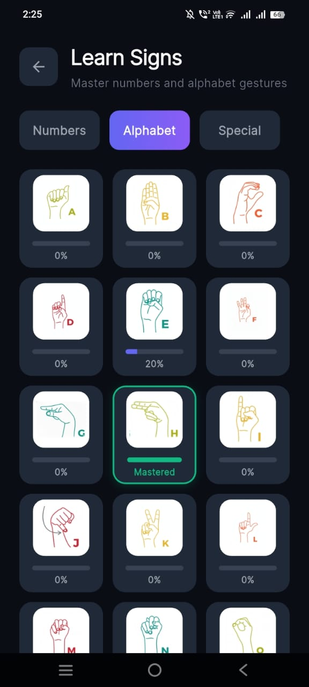
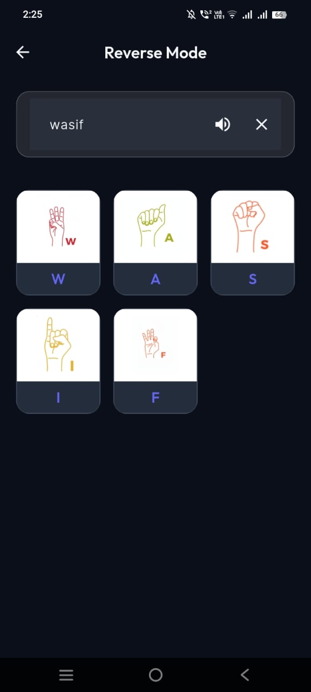
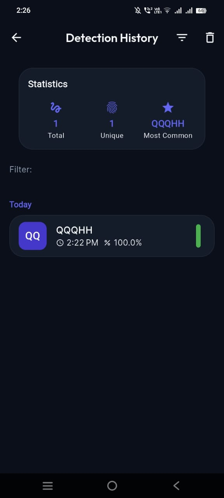
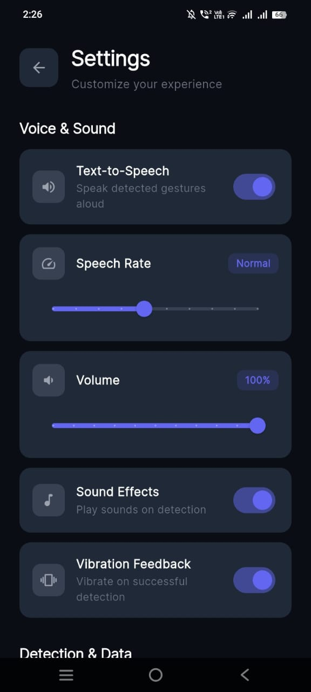
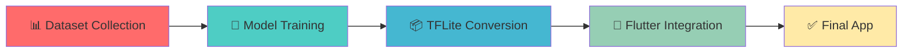
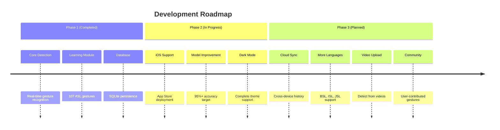

<div align="center">

# 🤟 SilentVoice AI
### *Breaking Communication Barriers with AI*

[](https://flutter.dev)
[](https://www.tensorflow.org/lite)
[](https://dart.dev)
[](LICENSE)


---

### 💡 *"What if your phone could understand sign language?"*

**That question led me to build SilentVoiceAI** — an AI-powered mobile app transforming how deaf & mute individuals communicate.

</div>

---

## 🌍 **The Reality**

<div align="center">

### 📊 **466 million** people worldwide use sign language as their primary language

### 😔 **Yet 99%** of hearing people don't understand it

</div>

---

## 🎯 **The Solution**

<table>
<tr>
<td width="50%">

### 🚀 **Two-Way Translation System**

**Sign → Text & Speech:**
- 📸 Camera detects hand gestures
- 🤖 AI recognizes ASL signs instantly  
- 💬 Converts to text in real-time
- 🔊 Speaks it out loud via TTS

**Text → Sign (Learning Mode):**
- ⌨️ Type any text
- 🖼️ See corresponding ASL gestures
- 📚 Interactive slideshow/grid view
- 🎓 Learn 107 gestures (A-Z, 0-9, words)

</td>
<td width="50%">

### ⚡ **Performance That Matters**

```yaml
Accuracy:    87% real-world performance
Speed:       <100ms response time
Model Size:  3.3 MB (ultra-lightweight)
Latency:     Zero lag, 100% offline
UI:          Smooth 60 FPS animations
Privacy:     On-device AI, no cloud
```

</td>
</tr>
</table>

---

## 🎥 **Demo & Screenshots**

<div align="center">

### 📹 **Full Demo Video**

https://github.com/user-attachments/assets/YOUR-VIDEO-LINK-HERE

> *Replace with your demo video link after uploading*

---

### 📱 **App Screenshots**

<table>
<tr>
<td align="center" width="33%">

<br/>
<b>🏠 Home Dashboard</b>
<br/>
<sub>Clean navigation hub</sub>
</td>
<td align="center" width="33%">

<br/>
<b>🎥 Real-time Detection</b>
<br/>
<sub>87% accuracy, <100ms</sub>
</td>
<td align="center" width="33%">

<br/>
<b>📚 Interactive Learning</b>
<br/>
<sub>107 ASL gestures</sub>
</td>
</tr>
<tr>
<td align="center" width="33%">

<br/>
<b>🔄 Text → Sign</b>
<br/>
<sub>Slideshow & grid view</sub>
</td>
<td align="center" width="33%">

<br/>
<b>📜 Smart History</b>
<br/>
<sub>Searchable & exportable</sub>
</td>
<td align="center" width="33%">

<br/>
<b>⚙️ Settings</b>
<br/>
<sub>Fully customizable</sub>
</td>
</tr>
</table>

> **Note:** Create `assets/screenshots/` folder and add your app screenshots with these exact names

</div>

---

## ✨ **Feature Highlights**

<div align="center">

| 🎥 **Detection** | 🔄 **Translation** | 🎓 **Learning** | 🔒 **Privacy** |
|:---:|:---:|:---:|:---:|
| Real-time gesture recognition | Two-way translation | Interactive learning module | 100% offline AI |
| 87% accuracy | Text ↔ Sign conversion | 107 ASL gestures | Zero data collection |
| <100ms latency | Text-to-Speech output | Progress tracking | On-device processing |
| Confidence thresholding | Multi-language support | Practice quiz mode | Secure local storage |

</div>

### 🌟 **Complete Feature List**

<details>
<summary><b>📸 Core Detection Features (Click to expand)</b></summary>

- ✅ **Real-time Hand Gesture Recognition** — Live camera feed with <100ms latency
- ✅ **107 Gesture Support** — A-Z, 0-9, common words & phrases
- ✅ **Confidence Meter** — Visual indicator (70%+ = green, <70% = red)
- ✅ **Text Accumulation** — Builds complete sentences letter-by-letter
- ✅ **Smart Controls** — Space, Delete, Clear All, Save, Speak
- ✅ **Temporal Smoothing** — Reduces detection jitter with majority voting
- ✅ **Auto-Save Sessions** — Every translation stored in SQLite

</details>

<details>
<summary><b>🔄 Reverse Mode (Text → Sign)</b></summary>

- ✅ **Text Input** — Type any text to see ASL gestures
- ✅ **Grid View** — See all gestures at once
- ✅ **Slideshow Mode** — Auto-advance with customizable speed (1s/2s/3s)
- ✅ **Manual Navigation** — Previous/Next/Jump to gesture
- ✅ **Loop Option** — Continuous playback for practice
- ✅ **Uppercase Conversion** — Automatic formatting

</details>

<details>
<summary><b>📚 Learning System</b></summary>

- ✅ **107 Gesture Library** — Complete ASL alphabet, numbers, words
- ✅ **Categorized Display** — Alphabet, Numbers, Words, Phrases
- ✅ **Progress Tracking** — Mark gestures as "learned" (saved to database)
- ✅ **Visual Grid Layout** — 2-column responsive design
- ✅ **High-Quality Images** — Hand-curated ASL sign images

</details>

<details>
<summary><b>💪 Practice Mode (Quiz)</b></summary>

- ✅ **Interactive Quiz** — Test your ASL skills
- ✅ **10 Random Questions** — From your learned gestures
- ✅ **Real-time Validation** — Instant ✅/❌ feedback
- ✅ **Score Tracking** — XX/10 with percentage
- ✅ **Time Tracking** — Session duration timer
- ✅ **Review Wrong Answers** — See correct gesture images

</details>

<details>
<summary><b>📜 History & Data Management</b></summary>

- ✅ **Persistent Storage** — SQLite database (survives app reinstall)
- ✅ **Search Functionality** — Filter by text content
- ✅ **Export Data** — Save as .txt file or share via WhatsApp/Email
- ✅ **Delete Individual Items** — With confirmation dialog
- ✅ **Clear All History** — Bulk delete option
- ✅ **Metadata Tracking** — Timestamp, confidence, session duration

</details>

<details>
<summary><b>⚙️ Settings & Customization</b></summary>

- ✅ **Confidence Threshold** — Slider (0.3–0.9, default 0.5)
- ✅ **Sound Effects** — Toggle detection sounds
- ✅ **Text-to-Speech** — Enable/disable voice output
- ✅ **Vibration Feedback** — Haptic response on detection
- ✅ **Detection Speed** — Slow/Normal/Fast modes
- ✅ **Theme Support** — Dark mode support (planned)

</details>

<details>
<summary><b>🎨 UI/UX Excellence</b></summary>

- ✅ **Glassmorphism Design** — Modern blurred glass effects
- ✅ **Smooth Animations** — Fade, scale, slide transitions
- ✅ **Micro-interactions** — Hover effects, ripples, shadows
- ✅ **Responsive Layout** — Adapts to phone/tablet screens
- ✅ **Google Fonts** — Professional typography
- ✅ **Color-coded Feedback** — Green (high conf.), Orange (med.), Red (low)
- ✅ **60 FPS Performance** — Buttery smooth scrolling & animations

</details>

---

## 🔬 **The Technical Journey**

<div align="center">



</div>

### **Step-by-Step Development Process:**

| Step | Phase | Details |
|:---:|-------|---------|
| 1️⃣ | **Dataset Collection** | Collected 21,000+ ASL images (200 per gesture × 107 gestures) |
| 2️⃣ | **Data Augmentation** | Applied rotation, flip, brightness, contrast variations (3× dataset size) |
| 3️⃣ | **Model Architecture** | Transfer learning with **MobileNetV2** (pre-trained on ImageNet) |
| 4️⃣ | **Training** | 50 epochs, Adam optimizer, categorical cross-entropy loss |
| 5️⃣ | **Achieved Accuracy** | **96% training accuracy**, **87% real-world accuracy** |
| 6️⃣ | **Model Compression** | TensorFlow Lite **quantization** (float16 → 3.3 MB model) |
| 7️⃣ | **Flutter Integration** | `tflite_flutter` plugin, camera streaming, SQLite persistence |
| 8️⃣ | **Optimization** | Reduced inference time to <100ms, 60 FPS UI |

---

## 🛠️ **Tech Stack**

<div align="center">

### **Frontend & Mobile**


### **AI & Machine Learning**


### **Database & Storage**


</div>

<details>
<summary><b>📦 Complete Dependency List (Click to expand)</b></summary>

```yaml
# Core Framework
flutter: 3.x
dart: >=2.19.0 <4.0.0

# State Management
flutter_riverpod: ^2.4.9              # Reactive state management

# AI & Computer Vision
tflite_flutter: ^0.11.0               # TensorFlow Lite inference
camera: ^0.11.0                       # Camera access
image: ^4.5.4                         # Image processing

# Database & Storage
sqflite: ^2.4.2                       # SQLite database
path_provider: ^2.1.5                 # File system paths
shared_preferences: ^2.5.3            # Key-value storage
flutter_secure_storage: ^9.2.2        # Encrypted storage

# UI & Animations
google_fonts: ^6.3.2                  # Custom fonts
flutter_animate: ^4.5.2               # Advanced animations
animations: ^2.0.11                   # Page transitions

# Audio & Feedback
flutter_tts: ^4.2.3                   # Text-to-Speech
audioplayers: ^6.1.0                  # Sound effects
vibration: ^2.0.0                     # Haptic feedback

# Utilities
go_router: ^14.6.2                    # Navigation
permission_handler: ^11.3.1           # Runtime permissions
http: ^1.6.0                          # HTTP requests (future API)
intl: ^0.20.2                         # Internationalization
equatable: ^2.0.7                     # Value equality
path: ^1.9.1                          # Path utilities

# Development Tools
flutter_test: sdk                     # Testing framework
flutter_lints: ^6.0.0                 # Code quality
mockito: ^5.4.4                       # Unit testing
flutter_launcher_icons: ^0.14.4       # Icon generation
```

</details>

---

## 🚀 **Getting Started**

### **Prerequisites**

```bash
✅ Flutter SDK: >=3.0.0
✅ Dart SDK: >=2.19.0
✅ Android Studio / Xcode
✅ Git
```

### **Installation**

```bash
# 1️⃣ Clone the repository
git clone https://github.com/muhammadwasif12/SilentVoiceAI-App-Sign-Langauage-Translator-For-Deaf-Mute.git
cd SilentVoiceAI-App-Sign-Langauage-Translator-For-Deaf-Mute

# 2️⃣ Install dependencies
flutter pub get

# 3️⃣ Run on device/emulator
flutter run

# 4️⃣ Build APK (Android)
flutter build apk --split-per-abi
```

### **APK Outputs**

After building, APKs will be in:
```
build/app/outputs/flutter-apk/
├── app-armeabi-v7a-release.apk   (32-bit devices)
├── app-arm64-v8a-release.apk     (64-bit devices) ⭐ Recommended
└── app-x86_64-release.apk        (Emulators)
```

---

## 📁 **Project Architecture**

<div align="center">

### **MVVM Clean Architecture**

```
┌─────────────────────────────────────────┐
│         PRESENTATION LAYER              │
│  (Screens, Widgets, Providers)          │
│  - camera_screen.dart                   │
│  - learning_screen.dart                 │
│  - gesture_detection_provider.dart      │
└──────────────────┬──────────────────────┘
                   ↓
┌─────────────────────────────────────────┐
│           DOMAIN LAYER                  │
│  (Business Logic, Use Cases)            │
│  - gesture_detection_service.dart       │
│  - tts_service.dart                     │
└──────────────────┬──────────────────────┘
                   ↓
┌─────────────────────────────────────────┐
│            DATA LAYER                   │
│  (Models, Repositories, Data Sources)   │
│  - tflite_service.dart                  │
│  - database_service.dart                │
│  - gesture_history_model.dart           │
└─────────────────────────────────────────┘
```

</div>

<details>
<summary><b>📂 Folder Structure (Click to expand)</b></summary>

```
lib/
├── core/                           # Shared utilities
│   ├── routing/                    # Navigation (GoRouter)
│   ├── providers/                  # Shared providers
│   ├── themes/                     # App themes
│   └── utils/                      # Helper functions
├── features/                       # Feature modules
│   ├── gesture_detection/
│   │   ├── data/                   # Models, repositories
│   │   ├── domain/                 # Business logic
│   │   └── presentation/           # UI & providers
│   ├── learning/
│   ├── history/
│   └── settings/
├── models/                         # Data models
├── providers/                      # State management
├── screens/                        # Full-screen pages
├── services/                       # Business logic
├── widgets/                        # Reusable components
└── main.dart                       # Entry point

assets/
├── models/
│   ├── gesture_model.tflite       # AI model (3.3 MB)
│   └── gesture_labels.json        # Label mappings
├── gestures/                      # 107 hand sign images
├── sounds/                        # Sound effects
└── screenshots/                   # App screenshots (for README)
```

**📘 For detailed architecture, see [PROJECT_STRUCTURE_GUIDE.md](PROJECT_STRUCTURE_GUIDE.md)**

</details>

---

## 🔄 **How It Works**

<details>
<summary><b>🎥 Real-time Detection Pipeline (Click to expand)</b></summary>

```
┌────────────────────────────────────────────────────────┐
│                  DETECTION PIPELINE                     │
└────────────────────────────────────────────────────────┘

1️⃣ Camera Capture (10 FPS)
   ↓
2️⃣ Image Preprocessing
   - Convert YUV420 → RGB
   - Resize 640x480 → 224x224
   - Normalize pixels (0-255 → 0.0-1.0)
   ↓
3️⃣ TFLite Model Inference (~50-100ms)
   - Input: [1, 224, 224, 3] float32
   - CNN (MobileNetV2 backbone)
   - Output: [1, 107] probabilities
   ↓
4️⃣ Post-processing
   - Find max probability index
   - Map to gesture label (0→"A", 25→"Z")
   - Check confidence threshold
   ↓
5️⃣ UI Update
   - Show gesture overlay (green/orange/red)
   - Append to detected text
   - Play sound/vibration (if enabled)
   - Trigger TTS (if enabled)
```

**🔬 For complete workflow, see [TECHNICAL_WORKFLOW.md](TECHNICAL_WORKFLOW.md)**

</details>

---

## 📊 **Performance Metrics**

<div align="center">

| Metric | Value | Details |
|:------:|:-----:|:--------|
| **Model Accuracy** | 96% | Training dataset performance |
| **Real-World Accuracy** | 87% | Live camera testing |
| **Inference Time** | <100ms | Per frame on mid-range device |
| **Model Size** | 3.3 MB | After TFLite quantization |
| **App Size** | ~28 MB | APK (arm64-v8a) |
| **Supported Gestures** | 107 | A-Z, 0-9, words, phrases |
| **Frame Rate** | 60 FPS | UI animations |
| **Camera FPS** | ~10 FPS | Optimal for real-time detection |

</div>

---

## 🎓 **Academic Information**

<div align="center">

### 🏫 **Final Semester AI Project**
**COMSATS University Islamabad, Sahiwal Campus**  
**BS Computer Science**  
**Semester:** 8th (AI Semester)  
**Submission Date:** December 2025

</div>

### 📝 **Project Documentation**

This repository includes comprehensive documentation:

- 📘 **[PROJECT_STRUCTURE_GUIDE.md](PROJECT_STRUCTURE_GUIDE.md)** — Complete file-by-file explanation
- 📗 **[TECHNICAL_WORKFLOW.md](TECHNICAL_WORKFLOW.md)** — Detailed system workflows  
- 📙 **[SilentVoiceAI_Project_Report.md](SilentVoiceAI_Project_Report.md)** — Full academic report

---

## 🤝 **Contributing**

Contributions are welcome! Here's how you can help:

<details>
<summary><b>🔧 Development Setup (Click to expand)</b></summary>

```bash
# 1. Fork the repository
# 2. Clone your fork
git clone https://github.com/YOUR-USERNAME/SilentVoiceAI-App-Sign-Langauage-Translator-For-Deaf-Mute.git

# 3. Create a feature branch
git checkout -b feature/AmazingFeature

# 4. Make your changes
# 5. Run tests
flutter test

# 6. Commit with conventional commits
git commit -m "feat: Add amazing feature"

# 7. Push to your fork
git push origin feature/AmazingFeature

# 8. Open a Pull Request
```

</details>

### **Contribution Ideas**

- 🌍 Add more sign languages (BSL, ISL, etc.)
- 🎨 Improve UI/UX
- 🤖 Enhance AI model accuracy
- 📱 iOS support & testing
- 🌐 Multi-language app translation
- 📚 Add more ASL gestures
- 🐛 Bug fixes & optimizations

---

## 📄 **License**

<div align="center">

This project is licensed under the **MIT License**.

[](LICENSE)

**You are free to:**
- ✅ Use commercially
- ✅ Modify
- ✅ Distribute
- ✅ Private use

**Under the condition that you:**
- 📝 Include the original license
- 📝 State changes made

See [LICENSE](LICENSE) file for details.

</div>

---

## 👤 **Contact & Connect**

<div align="center">

### **Muhammad Wasif**

[](https://linkedin.com/in/your-profile)
[](https://github.com/muhammadwasif12)
[](mailto:your-email@example.com)

**Project Link:** [SilentVoice AI Repository](https://github.com/muhammadwasif12/SilentVoiceAI-App-Sign-Langauage-Translator-For-Deaf-Mute)

</div>

---

## 🙏 **Acknowledgments**

<div align="center">

| Category | Thanks To |
|:--------:|-----------|
| 🎓 **Mentor** | Prof. **[Name]** — AI model optimization guidance |
| 📊 **Dataset** | ASL hand signs dataset contributors |
| 💻 **Flutter Community** | Amazing packages & support |
| 🤖 **TensorFlow Team** | TFLite framework |
| 🎨 **UI Inspiration** | Dribbble & Behance designers |

</div>

---

## 🔮 **Future Roadmap**

<div align="center">



</div>

### **Planned Features**

- [ ] 🍎 iOS version with App Store deployment
- [ ] 🌙 Complete dark mode support
- [ ] 🎥 Video upload & detection
- [ ] ☁️ Cloud sync (Firebase)
- [ ] 🌍 Multiple sign languages (BSL, ISL, JSL)
- [ ] 👥 Community gesture contributions
- [ ] 📈 Analytics dashboard
- [ ] 🎮 Gamification for learning
- [ ] 🗣️ Voice-to-Sign translation
- [ ] 🌐 Web version (Flutter Web)

---

<div align="center">

## ⭐ **Star History**

[](https://star-history.com/#muhammadwasif12/SilentVoiceAI-App-Sign-Langauage-Translator-For-Deaf-Mute&Date)

---

### 💬 **Discussion Prompts**

**Would this help in daily life?**  
**Developers: What feature would you add next?**  
**Let's connect and build tech for good! 🤝**

---

## 📢 **Show Your Support**

**⭐ If this project helped you or inspired you, please consider:**
- Giving it a **star** on GitHub
- Sharing it with your network
- Contributing to the codebase
- Reporting bugs or suggesting features

---


**Made with ❤️ by Muhammad Wasif**  
*Breaking barriers, one gesture at a time*

</div>
